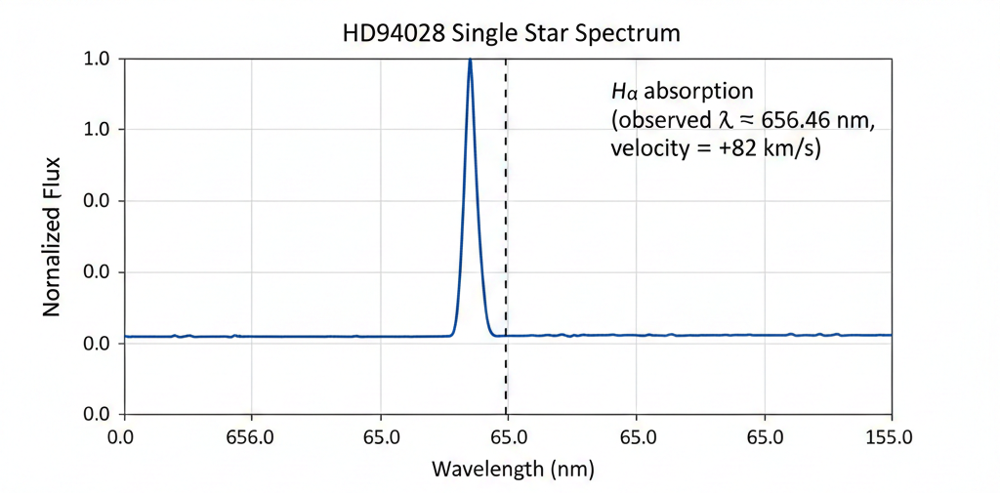
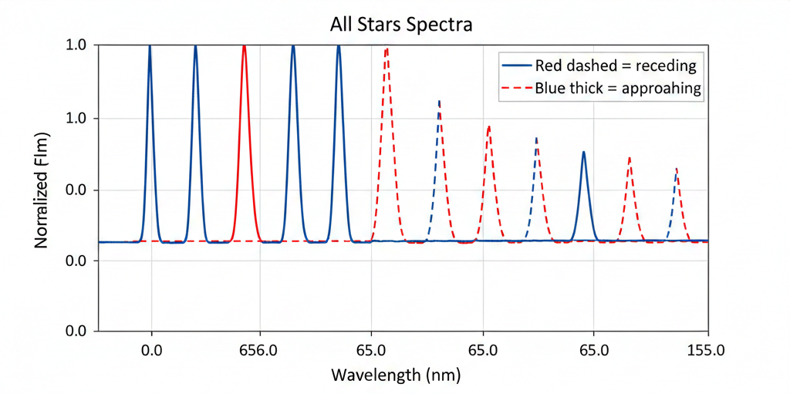

# 🔭 Stellar Motion Analysis using MATLAB

This project analyzes the **radial velocity** of stars using Doppler shift (redshift/blueshift) from their spectra. It focuses on the Hydrogen-alpha (Hα) absorption line at rest wavelength 656.28 nm to determine how fast stars are moving toward or away from Earth.

## Project Overview
- Plot the spectrum of individual stars (e.g., HD94028)
- Find the observed wavelength of the Hα line (minimum intensity point)
- Calculate redshift z = (λ_observed / λ_rest) - 1
- Compute radial velocity v = z × c (where c = 299792 km/s)
- Loop through multiple stars, plot spectra (red dashed for receding, blue solid for approaching)
- Display stars moving away from Earth

# 🧮 Physics Logic & Calculations
To calculate the motion, the script executes the following algorithm:Identify the $H\alpha$ line: Locate the minimum intensity point (absorption dip).
Calculate Redshift ($z$): $$z = \frac{\lambda_{observed}}{\lambda_{rest}} - 1$$(where $\lambda_{rest} = 656.28$ nm)
Compute Radial Velocity ($v$):$$v = z \times c$$(where $c = 299,792$ km/s)

## Files Included
- `stellar_motion_analysis.m` → Main script with calculations and plots
- `starData.mat` → Data file (load starData; contains lambda, spectra, starnames)
- `README.md` → This file

## How to Run
1. Open MATLAB
2. Set the current folder to this repository
3. Run the script: `stellar_motion_analysis`

## Example Plots

*HD94028 ka spectrum with marked Hα line (~ +82 km/s redshift)*

*Sab stars ke overlaid spectra (red dashed = receding, blue thick = approaching)*

## Example Output
- For HD94028: Radial velocity ≈ **+82 km/s** (positive = receding/redshift)
- Plots show spectra with marked Hα dip and legend for all stars

Data Source: MATLAB Onramp course (Stellar Motion project section)

Created by Shubham | Uttar Pradesh, India | January 2026
 readme file is this 
